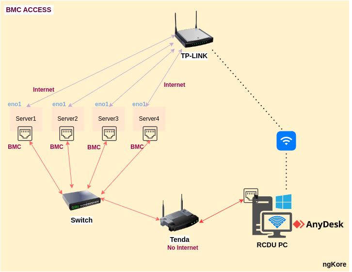

# BMC Access Architecture

The Network Architecture for accessing the BMC that we are using right now is like this:

* Two different router are being used: Tenda(with no internet) and TP-Link(with internet)
* RCDU PC is connected to TP-Link wirelessly(WI-FI) as well as connected to Tenda through wired connection. 
* Tenda router is connected with L2-Switch 