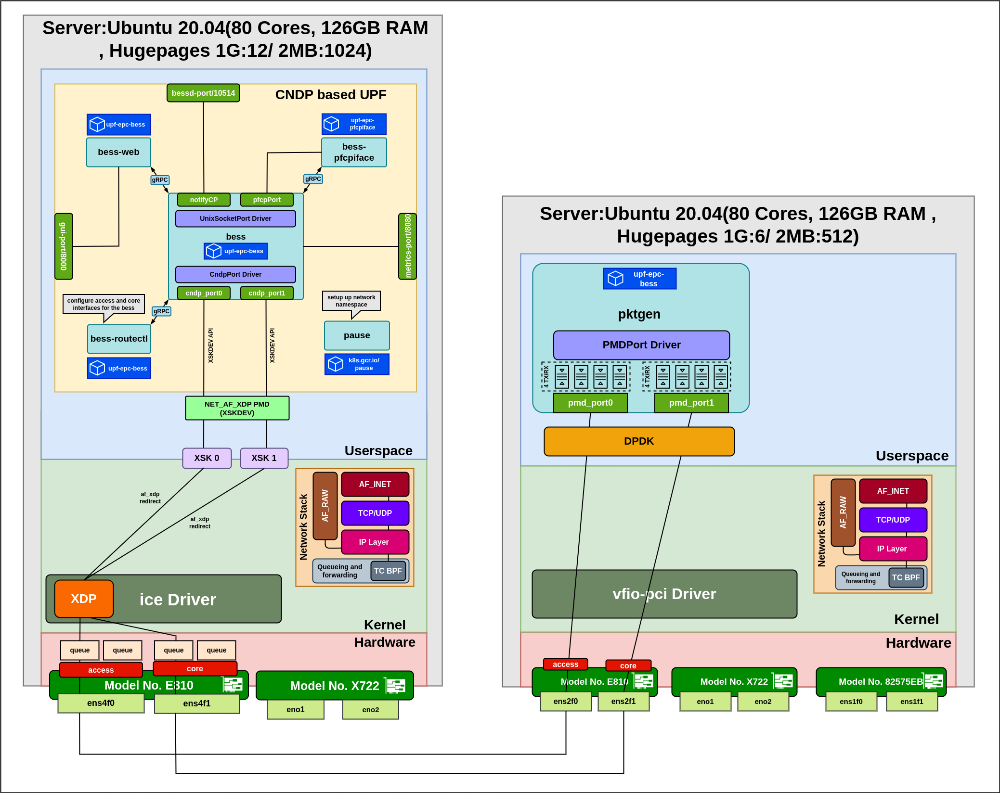

# CNDP based UPF Bencharmarking Architecture
**Server 2 and Server 3 have been used in this deployment**

This is the network architecture we are using for the bencharmarking of the CNDP based UPF:

* Intel NIC E810 has been used for both the interfaces in both the server.
* SFP modules have been used.
* DPDK based packet generator is used.