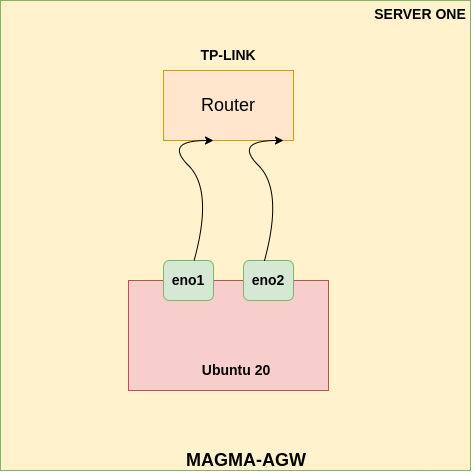

# Magma Access-Gateway Deployment
**Used Server 1 for this deployment**

This is the network architecture we are using for deploying the Access Gateway of Magma:

* Router is only shared with this server.
* eno1 and eno2 will be changed to eth0 and eth1 after the deployment.
* eno2 must have static ip address.