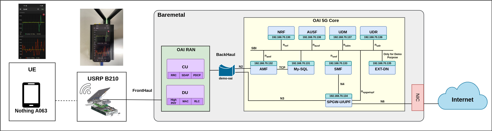

# OAI Core Deployment with Nothing Phone.

**Server 1 is used in this deployment**

This is the network architecture we are using for the OAI Core Deployment with USRP & Nothing Phone:

- n78 band is used
- USRP B210 is used
- RAN and Core, both are running in the same server i.e. Server-1.
