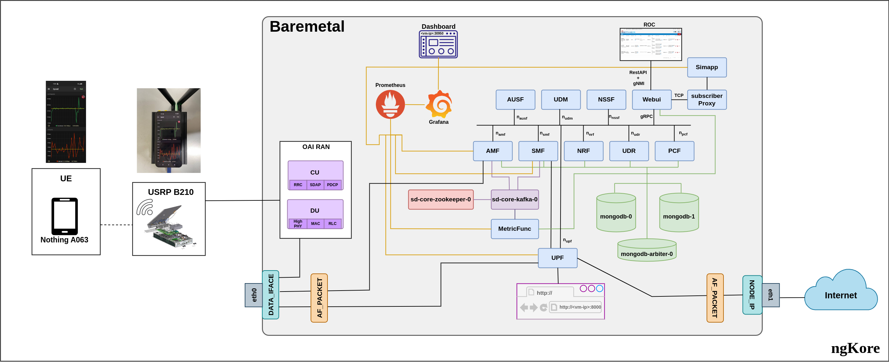

# SD-Core Deployment in AF-PACKET Mode

**Server 3 was used for this deployment**

This is the network architecture we are using for the deployment of SD-Core in af_packet mode.

- RAN and Core are both running in the same server.
- Ngap external ip and data iface were same in this deployment.
- MASQUERADE on the node interface.
